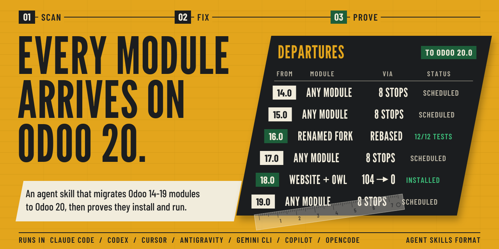
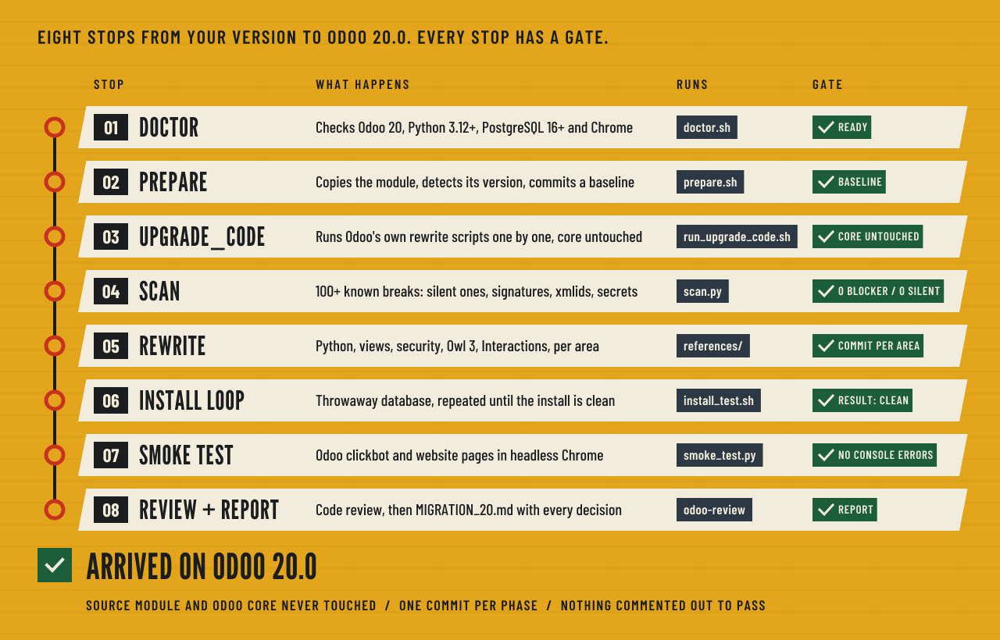

<picture>
  <source media="(prefers-color-scheme: dark)" srcset="assets/banner-dark.svg">
  
</picture>

<p>
  
  
  
  
</p>

**odoo-migrate-to-20** is an agent skill that migrates a custom Odoo module (or a whole addons
folder) from **Odoo 14, 15, 16, 17, 18 or 19 to Odoo 20**, then proves the result **installs and
runs**. It installs the module on a throwaway database and clicks through it in a real browser;
getting the code to compile is not where it stops. It works with any coding agent that can read
files and run shell commands.

- **Nothing silent gets through.** The scanner knows 100+ breaking changes, and Odoo 20 breaks some
  code without an error: server `t-esc`
  renders nothing, `_sql_constraints` are dropped, `name_get` is never called, `oe_chatter`
  disappears, and overrides with an old signature crash only when called. The scanner counts these
  as seriously as install errors.
- **Your original is never touched.** The module is copied into a separate Odoo 20 tree, with one
  git commit per phase, so every change is a diff you can review. Odoo core is checked for changes
  after every automatic pass.
- **Forks are rebased, not ported.** A renamed copy of an Odoo module is rebuilt from the upstream
  Odoo 20 code, keeping your model names and only your real changes.

## Install in 3 steps

**1. Install the skill.** Run this, then pick your coding agent when it asks:

```bash
npx skills add tanim913/odoo-migrate-to-20 -g
```

No Node.js? Use the included installer instead:

```bash
git clone https://github.com/tanim913/odoo-migrate-to-20.git
cd odoo-migrate-to-20
./install.sh --for all --project ~/work/my-odoo-repo    # or e.g. --for cursor,claude
```

`install.sh` also adds the `/odoo-migrate-to-20` command to Cursor, Antigravity, Copilot and
Gemini CLI.

**2. Check your machine.** Run this once; it must end with `READY`:

```bash
~/.agents/skills/odoo-migrate-to-20/scripts/doctor.sh
```

If it says NOT READY, its FAIL lines tell you what is missing: usually an Odoo 20 checkout,
Python 3.12+ or PostgreSQL 16+ (see [Requirements](#requirements)).

**3. Use it.** In your coding agent, type:

```
/odoo-migrate-to-20 ~/work/odoo16/addons/my_module
```

or just ask: *"migrate my_module from 16 to 20"*.

<details>
<summary><b>For AI agents: "install this for my &lt;agent&gt;"</b></summary>

If a user asks you to install this repository for their coding agent, run the full installer for
that agent, then the doctor, and report its result:

```bash
git clone --depth 1 https://github.com/tanim913/odoo-migrate-to-20.git /tmp/odoo-migrate-to-20
/tmp/odoo-migrate-to-20/install.sh --for <target> [--project <the user's repo>]
~/.agents/skills/odoo-migrate-to-20/scripts/doctor.sh
```

| The user's agent | `<target>` | Needs `--project` |
|---|---|---|
| Claude Code | `claude` | no |
| Cursor | `cursor` | optional (adds the project command too) |
| OpenAI Codex | `codex` | no |
| Google Antigravity | `antigravity` | **yes** (workflow and skill file live in the project) |
| GitHub Copilot | `copilot` | yes, for the `/odoo-migrate-to-20` prompt file |
| Gemini CLI | `gemini` | optional |
| OpenCode or any other skill-aware agent | `agents` | no |
| An agent that only reads AGENTS.md | `agents-md` | **yes** |

- Several agents at once: `--for cursor,claude`.
- If `install.sh` cannot run (no bash), use `npx skills add tanim913/odoo-migrate-to-20 -g -a <agent-name>` instead.
- `install.sh --dry-run` shows the changes first, and `--uninstall` removes them.
- Don't start a migration until `doctor.sh` prints READY; tell the user what its FAIL lines ask for.

</details>

## Works in your agent

The skill is written in the open [Agent Skills](https://agentskills.io) format: a `SKILL.md` with
scripts and references. `install.sh` keeps **one canonical copy** in
`~/.agents/skills/odoo-migrate-to-20`. Skill-aware agents link to it; tools that only understand
rules or commands get a small adapter that points to it. An update in one place reaches all of them.

| Agent | `--for` | What gets installed | How you start it |
|---|---|---|---|
| Claude Code | `claude` | `~/.claude/skills/…` (+ `<project>/.claude/skills` with `--project-skills`) | `/odoo-migrate-to-20 …` or ask |
| OpenAI Codex | `codex` | `~/.codex/skills/…` | ask "migrate X to Odoo 20" |
| Cursor | `cursor` | `.cursor/rules/odoo-migrate-to-20.mdc` + `.cursor/commands/odoo-migrate-to-20.md` (user and project) | `/odoo-migrate-to-20 <module path>` in Agent chat, or ask |
| Google Antigravity | `antigravity` | `<project>/.antigravity/skills/odoo-migrate-to-20.md` + `<project>/.agent/workflows/odoo-migrate-to-20.md` | the `/odoo-migrate-to-20` workflow, or ask |
| Gemini CLI | `gemini` | `~/.gemini/commands/odoo-migrate-to-20.toml` (+ project) | `/odoo-migrate-to-20 <module path>` |
| GitHub Copilot | `copilot` | `~/.copilot/skills/…` + `<project>/.github/prompts/odoo-migrate-to-20.prompt.md` | `/odoo-migrate-to-20` in Copilot Chat (agent mode) |
| OpenCode and other skill readers | `agents` | `~/.agents/skills/odoo-migrate-to-20` (+ `<project>/.agents/skills` with `--project-skills`) | picked up automatically |
| Anything that reads AGENTS.md | `agents-md` | a marked section in `<project>/AGENTS.md` | ask |

<details>
<summary><b>install.sh options</b></summary>

```text
./install.sh [--for LIST] [--project DIR] [--project-skills] [--dest DIR] [--link] [--uninstall] [--dry-run]
```

| Option | Effect |
|---|---|
| `--for LIST` | comma-separated targets from the table above, or `all` (default: `agents,claude`) |
| `--project DIR` | also install project-level adapters into `DIR` (the repo you open in the IDE) |
| `--project-skills` | with `--project`, also link the skill inside the project; only for a repo shared with a team, since a second copy makes some tools list the skill twice |
| `--dest DIR` | where the canonical copy lives (default `~/.agents/skills/odoo-migrate-to-20`) |
| `--link` | symlink instead of copy, for people developing the skill |
| `--uninstall` | remove everything it installed for the chosen targets |
| `--dry-run` | print what would change |

Recommended as well: Odoo's own guideline skills, shipped with Odoo 20 in `<odoo20>/skills/`
(`odoo-guidelines`, `odoo-web-guidelines`, `odoo-security`, `odoo-review`). Copy them next to this
skill, or leave them where they are: the workflow reads them from `$ODOO20_SERVER/skills/` when
they aren't installed.

</details>

## The route

<picture>
  <source media="(prefers-color-scheme: dark)" srcset="assets/route-dark.svg">
  
</picture>

Every stop has a gate, and the route doesn't move on until the gate is met:

1. **Doctor** (`doctor.sh`) checks Odoo 20, Python 3.12+, PostgreSQL 16+ and Chrome. Migration
   starts only at **READY**, or when you accept what is missing (for example, no enterprise).
2. **Prepare** (`prepare.sh`) copies the module to `$MIG20_TARGET_ROOT/<project>/<module>`,
   detects the source version, fingerprints the original and commits a baseline.
   `fork_check.py` decides whether the module is a renamed fork (see below).
3. **upgrade_code** (`run_upgrade_code.sh`) runs Odoo 20's own rewrite scripts safely: one script
   at a time, module only, never through `odoo-bin`, `owl3-migration` included. It fails if Odoo
   core or enterprise changed.
4. **Scan** (`scan.py`) checks 100+ known 14→20 breaking changes and reports each hit with
   `file:line`, sorted by severity: BLOCKER, SILENT, RUNTIME, WARN. Target: **0 BLOCKER, 0 SILENT**.
5. **Rewrite**: renames that cross Python, XML and JS go first, then each area (Python and
   controllers, views and security, backend JS, website) is migrated against the references.
   Agents that can run parallel sub-agents use them for the JS and website areas; others do the
   areas one after another.
6. **Install loop** (`install_test.sh`) installs on a throwaway database (`mig20_*`) until
   `RESULT: CLEAN`, runs the module's own tests, then drops the database.
7. **Smoke test** (`smoke_test.py`) runs Odoo's clickbot over the module's apps, opens every other
   menu action and its "new" form, and every website page as public and admin, in headless Chrome.
   Then a short flow tour of the module's main flow proves the migrated code works, not just loads.
   Any browser console error fails the run, and the screenshots of a failure are handed to the agent.
8. **Review and report**: a code review of the whole diff (using Odoo's `odoo-review` skill when
   available), then `MIGRATION_20.md` with the decisions, what was not migrated, security findings,
   data-migration notes and what to check by hand.

## What it catches

| Area | Examples |
|---|---|
| Manifest | a version format that silently makes the module uninstallable, removed keys, removed or merged dependencies, missing files, external Python libraries |
| Python / ORM | `odoo.osv` removal, `read_group`, `name_get`, `_sql_constraints`, `@api.model` create, the access-check API, `odoo.http` submodules, renamed fields, override signatures against Odoo 20, methods that now require an identity check |
| Security | `ir.model.access` + `ir.rule` → `ir.access`, `res.groups` privileges, public-access review, leaked credentials in source |
| Views / QWeb | `attrs`/`states`, `tree` → `list`, `kanban-box` → `card`, chatter, search view schema, server `t-esc`/`t-raw` (render nothing in 20), `t-call` parameters, report layouts, mail templates, renamed xmlids |
| Backend JS | Owl 2 → Owl 3 (`useProps`, `proxy`, `signal.ref`, template `this.`), legacy widgets, three-argument `patch`, services, widget renames, asset bundles |
| Website | publicWidget → Interactions, jQuery removal, frontend RPC, snippet options → html_builder, website_sale template and route changes, portal entries |
| Styling | Bootstrap 4 → 5, Font Awesome → Odoo's `oi` icon font |
| Tests and tours | Odoo 20's strict tour schema (`extra_trigger`, `position`, `edition`, `test: true`…), old `run` helpers, jQuery-only selectors, `tour.register`, steps that relied on the pre-18 implicit click, `phantom_js`, QUnit |

Beyond regular expressions, `scan.py`:
- **imports every `odoo.*` import for real** on Odoo 20, so moved helpers and renamed classes are
  caught. A failing import inside `try/except ImportError` is flagged as silent, because on 20 the
  fallback branch would always run;
- **resolves every JS import** to a file in Odoo 20 and checks each imported name is exported. One
  missing file breaks the whole asset bundle;
- imports every third-party library with your Odoo 20 Python;
- compares every override of a core method with its Odoo 20 signature;
- checks every external xmlid the module references against Odoo 20;
- looks for secrets.

## How it proves the result

- **A real install**, not a syntax check, on a throwaway PostgreSQL 16 database, repeated until
  `RESULT: CLEAN`, with the module's own tests.
- **A real browser.** Odoo's clickbot and the module's website pages run in headless Chrome, and
  one console error fails the run. Odoo skips browser tests without Chrome or `websocket-client`;
  `doctor.sh` warns, and `install_test.sh` reports it as a problem, so a skipped run is never
  mistaken for a pass.
- **A real flow.** A short tour of the module's main flow (create and save the main record,
  submit the website form…) proves the migrated widgets and interactions work. When a browser test
  fails, the failing step and the screenshot Odoo took at that moment go straight to the agent.
- **Control runs.** When a failure looks unrelated to your code, the same smoke test runs on the
  upstream or core module alone. A failure that reproduces there is recorded, not blamed on the
  migration.
- **Proof of no side effects.** The original module's fingerprint is compared at the end, core
  must have no git changes, and no `mig20_*` database may be left behind.

### Tested routes

| From | Module | Result |
|---|---|---|
| 18.0 | website pages, Owl backend widgets, a mail hook | 104 blocking, silent or runtime findings → clean scan, clean install, browser smoke test passed |
| 16.0 | a renamed fork of an Odoo module | detected as a fork, rebased on upstream 20, clean install, 12 of 12 upstream tests passed |

<details>
<summary><b>Forks: rebase instead of port</b></summary>

`fork_check.py` compares the module's models and files with older Odoo checkouts
(`MIG20_OLD_SOURCES`). When it prints `VERDICT: FORK`, the module is a renamed copy of an Odoo or
vendor module that also exists in Odoo 20:

1. `rebase_fork.py <UPSTREAM_20> <DEST>` replaces the copy with the upstream Odoo 20 module,
   renamed to the fork's name. xmlids, template names, groups, asset paths, `@module/` JS imports
   and `odoo.addons.module` imports are renamed. **Model names are kept**, so the database schema
   is unchanged.
2. The fork is diffed against its upstream at the source version, and only the meaningful custom
   changes are re-applied. The rest is listed in the report.
3. Licences travel with code: `rebase_fork.py` prints a LICENSE line when the upstream licence
   differs from the fork's (Odoo Enterprise code cannot be relicensed as LGPL).

</details>

<details>
<summary><b>Guardrails the agent follows</b></summary>

- Never modify the source module, `$ODOO20_SERVER` or `$ODOO20_ENTERPRISE`.
- Only throwaway databases named `mig20_*`, always dropped; never other databases.
- **Never comment out code, assets, data files or xpaths to make an install pass.** A feature
  that can't be migrated now is listed under "Not migrated" in `MIGRATION_20.md`, with the reason.
- Never write an API, field, template id, xpath target, widget or icon name from memory; grep the
  Odoo 20 source first.
- Migration is not refactoring: change what 20 requires, in the style of current core code.
- A credential found in the source is removed from the copy and reported, so it can be revoked.
- Anything installed outside the project (for example a missing Python library) is stated.

</details>

## Requirements

- Linux or macOS (Windows: use WSL), with bash, git, rsync and python3.
- An **Odoo 20** community checkout: `git clone -b 20.0 --depth 1 https://github.com/odoo/odoo`.
  Enterprise is optional.
- A Python **3.12+** virtualenv: `pip install -r odoo/requirements.txt websocket-client`.
- **PostgreSQL 16+**, with a role that can create databases.
- Chrome or Chromium for the browser smoke tests. Without it they are skipped, and the skill says so.
- A capable agentic model with a large context gives the best results; the workflow is long. The
  scripts do the heavy, deterministic work (scan, install, test), so results don't depend on the
  model remembering Odoo APIs.

<details>
<summary><b>Configuration</b></summary>

`doctor.sh` auto-detects everything it can, prints OK / WARN / FAIL, and with `--write` saves the
result to `~/.config/odoo-migrate-to-20/config.env` (one `KEY=VALUE` per line). Environment
variables override it; override anything on the command line:

```bash
~/.agents/skills/odoo-migrate-to-20/scripts/doctor.sh \
    ODOO20_SERVER=~/src/odoo20 ODOO20_PYTHON=~/venvs/odoo20/bin/python \
    ODOO20_CONF=~/odoo20.conf --write
```

| Setting | Meaning |
|---|---|
| `ODOO20_SERVER` | Odoo 20 community checkout (required) |
| `ODOO20_ENTERPRISE` | enterprise addons (optional) |
| `ODOO20_PYTHON` | Python 3.12+ with Odoo 20 requirements (required) |
| `ODOO20_CONF` | an odoo.conf holding DB credentials (optional) |
| `MIG20_DB_HOST`, `MIG20_DB_PORT`, `MIG20_DB_USER`, `MIG20_DB_PASSWORD` | a PostgreSQL 16+ server for throwaway test databases |
| `MIG20_TARGET_ROOT` | where migrated projects go (`<root>/<project>/<module>`) |
| `MIG20_HTTP_PORT` | port for test servers (default 8121) |
| `MIG20_DATA_DIR` | Odoo data dir for test filestores |
| `MIG20_OLD_SOURCES` | older Odoo checkouts (colon-separated), used to look up what an API used to be and to detect forks |

All settings are documented at the top of `scripts/env.sh`.

</details>

## What you get

The migrated copy lands in `$MIG20_TARGET_ROOT/<project>/<module>`, inside a git repo with one
commit per phase. The run ends with `MIGRATION_20.md`:

- the scan summary before and after;
- what `upgrade_code` changed and what was done by hand, per area;
- decisions to confirm, such as access rights, icon mapping and removed dependencies;
- anything not migrated, with the reason;
- security findings and data-migration notes for existing databases;
- what to check by hand.

To try the module, add the project folder to your Odoo 20 `addons_path`.

## Scripts

| Script | Purpose |
|---|---|
| `install.sh` | install the skill or its adapters for each agent |
| `scripts/doctor.sh` | resolve and save the configuration, check prerequisites |
| `scripts/prepare.sh` | copy the module, detect its version, commit a baseline, fingerprint the source |
| `scripts/fork_check.py` | detect a renamed fork of an Odoo or vendor module and its Odoo 20 counterpart |
| `scripts/rebase_fork.py` | rebuild a fork from the upstream Odoo 20 module, renamed, keeping model names |
| `scripts/run_upgrade_code.sh` | run Odoo's upgrade scripts safely (per script, module only, core-untouched check) |
| `scripts/scan.py` | find breaking changes (`--json`, `--area`, `--fix-tesc`, `--icons`) |
| `scripts/install_test.sh` | install (and test) on a throwaway database, summarise problems and failure screenshots, drop the database (`--tags` re-runs one test) |
| `scripts/smoke_test.py` | generate a browser smoke-test module (clickbot, website pages, flow tours) |

Knowledge lives in `references/`: 15 files on the upgrade tool, manifest, Python/ORM, field
renames, controllers, views, QWeb/reports/mail, security, backend Owl 3, website interactions,
website builder, website_sale/portal, SCSS/icons, tests and tours, and lessons learned from real
migrations.

The scripts also work on their own, without an agent:

```bash
S=~/.agents/skills/odoo-migrate-to-20/scripts
python3 $S/scan.py path/to/module                   # every Odoo 20 break, with file:line
python3 $S/fork_check.py path/to/module             # is it a renamed copy of an Odoo module?
$S/install_test.sh path/to/addons_dir my_module     # install on a throwaway database, report errors
```

## Contributing

Every migration should leave the skill better:

- Add each new kind of break to `references/lessons-learned.md`, and where possible as a `scan.py`
  rule or check.
- Keep the references verified against the Odoo 20 source, and cite the file that proves each rule.

The README artwork is generated by `assets/src/build_assets.py`. It uses League Gothic and Barlow
Condensed (SIL Open Font License); see the script for where to get the fonts.

## License

MIT © tanim913. Odoo is a trademark of Odoo S.A.; this project is independent and not affiliated
with or endorsed by Odoo S.A.
